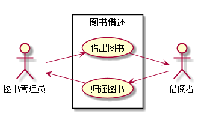
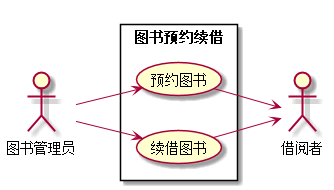

实验二：图书管理系统用例建模
==============
|学号|班级|姓名|照片|
|:-:|:-:|:-:|:-:|
|201510414327|软工3班|郑傲东|无|

1.图书管理系统的用例关系图
--------------
### 1.1 plantuml源码如下:
<pre>
@startuml
left to right direction
skinparam packageStyle rectangle
actor 借阅者
actor 图书管理员
actor 系统管理员
rectangle 图书管理 {

   图书管理员-->(借出图书)
   图书管理员-->(归还图书)
   图书管理员-->(续借图书)
   图书管理员-->(预约图书)
   图书管理员-->(查询图书)
   图书管理员-->(查询账户)
   图书管理员-->(查询系统信息)

   (查询账户) <--借阅者
   (查询图书) <--借阅者
   (查询系统信息) <--借阅者

   系统管理员-->(录入标题)
   系统管理员-->(更新标题)
   系统管理员-->(删除标题)
   系统管理员-->(录入书目)
   系统管理员-->(更新书目)
   系统管理员-->(删除书目)
   系统管理员-->(注册借书)
   系统管理员-->(更新借书)
   系统管理员-->(注销借书)

}
@enduml
</pre>

### 1.2 用例图如下:

2.参与者说明
-------
### 2.1 系统管理员

主要职责是：系统管理员登陆后，可对借阅者信息进行维护和数目进行维护，定期维护有利于整个系统的流畅和稳定。

### 2.2 图书管理员

主要职责是：对读者的借书、还书等操作进行处理,也可以对图书进行相应的操作，查看图书的借阅情况，对读者进行定时期的信息维护，借阅者也可在此办理或退订自己的借阅卡，管理员还要定时的更新相应的数目信息等。

### 2.3 借阅者

主要职责是：可以通过查询图书并借取或者归还图书，也可查询自己的借阅情况和个人信息。可通过管理员办理借阅卡，若借记卡不慎丢失，可进行挂失并找管理员进行补卡操作。

3.用例规约表
-------
### 3.1 "图书借还"用例
| | |
|:------:|:------:|
|用例名称|图书借还|
|参与者|图书管理员（主要参与者）、借阅者（次要参与者）|
|前置条件|图书管理员已被识别和授权|
|后置条件|存储借书记录，更新库存数据|
|主事件流|1.图书管理员将读者借书卡提供给系统；2.系统验证读者身份和借还书条件；3.图书管理员将读者所借图书输入系统；4.系统记录借还书信息，并且修改图书的状态和此书的可借数量；5.图书管理员确认归还图书信息登记完毕；6.系统打印借还书清单，交易成功完成|
|备注|图书馆开架借阅，读者可到管理员处办理借阅卡，找到书后办理借阅手续，每本书都是可识别的|
### 3.2 "图书预约续借"用例
| | |
|:------:|:------:|
|用例名称|图书预约续借|
|参与者|图书管理员（主要参与者）、借阅者（次要参与者）|
|前置条件|图书管理员已被识别和授权|
|后置条件|存储预约、续借记录，更新库存数据|
|主事件流|1.借阅者向图书管理员发出预约、续借请求；2.系统验证借阅者信息；3.图书管理员向系统输入预约、续借信息；4.系统记录预约、续借信息，并且修改图书的状态和此书的可借数量；5.图书管理员确认预约、续借信息登记完毕；6.系统打印预约、续借清单，交易成功完成|
|备注|预约、续借应提前向图书管理员发出申请|
### 3.3 "系统管理"用例
| | |
|:------:|:------:|
|用例名称|系统管理|
|参与者|系统管理员（主要参与者）|
|前置条件|系统管理员已被识别和授权|
|后置条件|存储数目修改记录，更新库存数据|
|主事件流|1.系统管理员进入系统；2.系统验证系统管理员身份；3.系统管理员对书目、借书信息进行修改等操作；4.系统记录管理员修改操作信息；5.图书管理员确认系统操作更新完毕；6.系统打印管理员修改清单，交易成功完成|
|备注|图书管理系统逐条记录系统管理员操作步骤，以便查找故障原因|
